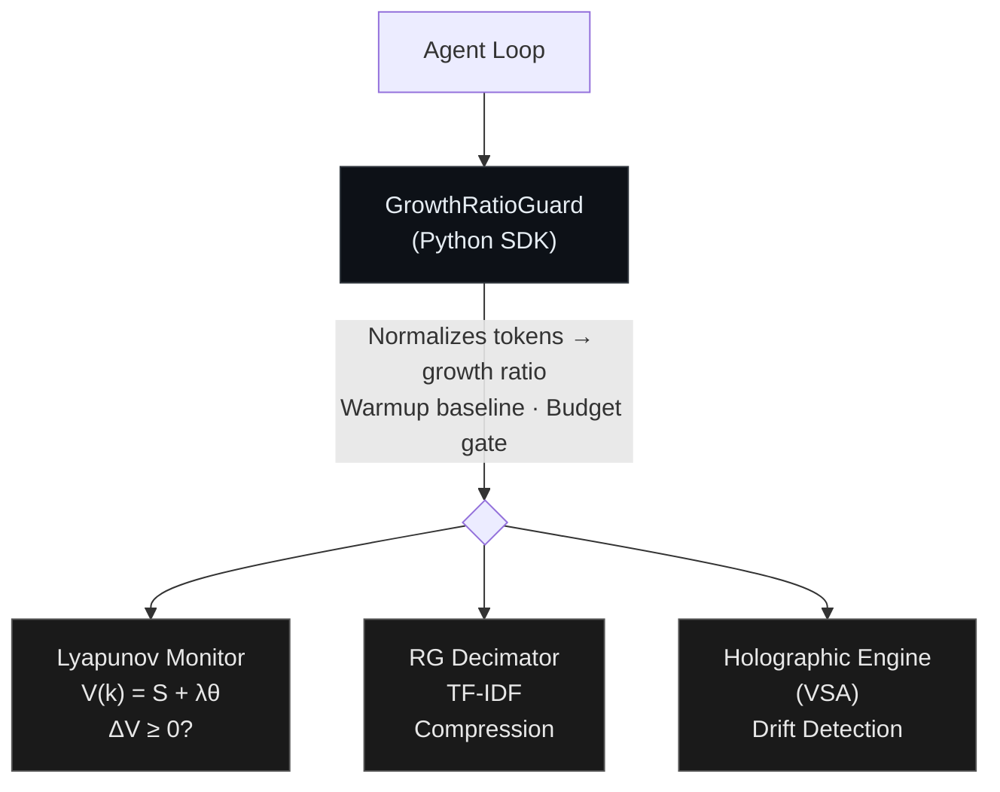

# state-harness 🌀

[](https://pypi.org/project/state-harness/)
[](https://pypi.org/project/state-harness/)
[](https://pypi.org/project/state-harness/)
[](src/)
[](LICENSE.md)

Lyapunov-stability monitor for multi-turn LLM agents. Detects token spirals, classifies failure patterns, and tells you why a task failed — no extra LLM calls.

```python
from state_harness import GrowthRatioGuard, FailureReport

guard = GrowthRatioGuard(token_budget=50_000)

with guard:
    for turn in agent_loop:
        result = llm.invoke(turn.prompt)
        guard.record_step(tokens_used=result.usage.total_tokens)

# What went wrong? (zero-cost, no LLM calls)
report = FailureReport.from_guard(guard)
print(report)
```

```
⚠️  STABILITY TRIPPED at turn 12

Pattern: Context Accumulation Spiral (confidence: 92%)
  • Last 5 turns all exceeded 1.5× baseline (4/4 were accelerating).
  • Peak growth ratio: 5.2× baseline.
  • Without intervention, projected cost was $0.0396 (actual: $0.0039).

Energy: ▁▁▁▁▁▂▂▃▄▆█
  Baseline: 1050 tokens/turn
  Peak ratio: 5.2× baseline

Cost: $0.0039 (saved ~$0.0357 by tripping early)

Suggested actions:
  🔴 1. Enable RG history compression in your agent loop.
     → Compressing older messages reduces prompt tokens by 40-60%.
  🟡 2. Lower the growth ratio threshold to 1.8×.
     → A lower threshold would have caught it earlier.
  🟢 3. Add a sliding-window context strategy.
     → Send only the last N messages plus a summary of earlier ones.
```

---

## Why this exists

Production multi-agent systems fail at rates of 41–87% ([Kore.ai 2026](https://kore.ai)). When an agent spirals — replaying full context, retrying a broken tool, drifting off-task — a budget cap will kill it, but tells you nothing about *why*.

State-harness monitors token consumption relative to a warmup baseline via a [Lyapunov energy function](https://en.wikipedia.org/wiki/Lyapunov_stability). When the growth ratio exceeds a threshold for W consecutive steps, it trips and classifies the failure pattern (context spiral, retry storm, policy drift) with fix suggestions — from the energy trajectory alone, no LLM calls.

`pip install state-harness` and wrap your agent loop.

### What it catches

| Pattern | Signal | Example |
|:---|:---|:---|
| **Context Spiral** | Token growth accelerating beyond baseline | Agent replaying full history each turn |
| **Retry Storm** | Low-variance repeated calls | Tool failing, agent retrying identically |
| **Policy Drift** | VSA similarity score dropping | Agent going off-topic mid-conversation |
| **Early Explosion** | Token spike in first 3 turns | Oversized system prompt or tool response |
| **Budget Exhaustion** | Cumulative spend hits ceiling | Complex task, not necessarily broken |

### Scope and limitations

State-harness does not improve resolve rates — a naive budget cap achieves comparable task success ([multi-trial results below](#multi-trial-validation-333-runs)). The value is:

1. **Failure diagnostics** — classified failure patterns with actionable fixes, not just "budget exceeded." No extra LLM calls.
2. **Compute efficiency on long loops** — 38.6% fewer search nodes and 30% less wall time on SWE-bench by terminating dead-end branches early.

Validated across 3,175 runs (4 benchmarks, 5-condition ablation, multi-trial with bootstrap CIs). Zero false positives across 7 models incl. 4 local via Ollama. Details in [Benchmarks](#benchmarks).

### When to use this

- **Search-tree agents** (MCTS, beam search) — per-branch caps look fine in isolation; tree-level cost explosion is silent.
- **Platform teams at scale** — failure classification at the edge, exported as OpenTelemetry attributes.
- **Benchmarking** — the ~4–5% nondeterminism floor means single-run deltas <8% are noise.

Not needed for chatbots, RAG, single-turn apps, or ReAct loops with <10 turns — `max_iterations` + budget cap suffice.

---

## Installation

```bash
pip install state-harness
```

Python ≥ 3.10. Pre-built wheels for Linux, macOS, Windows (x86_64 + ARM64). No Rust toolchain needed.

### From source (for development)

```bash
git clone https://github.com/vishal-dehurdle/state-harness.git
cd state-harness

python -m venv .venv && source .venv/bin/activate

# Install Rust (if not already installed)
curl --proto '=https' --tlsv1.2 -sSf https://sh.rustup.rs | sh

pip install maturin
maturin develop --release

# Run tests
pip install pytest
pytest tests/
```

---

## Quickstart

### Basic: GrowthRatioGuard (recommended)

`GrowthRatioGuard` normalizes token usage against a baseline — trips only on *disproportionate* growth, not natural context-window accumulation.

```python
from state_harness import GrowthRatioGuard, StabilityViolation

guard = GrowthRatioGuard(
    token_budget=100_000,     # hard ceiling
    ratio_threshold=2.0,      # trip when turn is 2× the baseline
    window=3,                 # 3 consecutive escalating turns to trip
    budget_gate=8_000,        # don't trip until 8K tokens spent
)

with guard:
    for turn in agent_loop:
        try:
            result = llm.invoke(turn.prompt)
            guard.record_step(
                tokens_used=result.usage.total_tokens,
                errors=0,
            )
        except StabilityViolation as e:
            print(f"Agent killed: {e}")
            break

print(f"Total cost: {guard.total_tokens} tokens")
print(f"Baseline: {guard.baseline} tokens/turn")
print(f"Peak ratio: {guard.current_ratio}×")
```

### Failure Diagnostics

After any execution (tripped or not):

```python
from state_harness import FailureReport

report = FailureReport.from_guard(guard, model="gemini-2.5-flash")

# Human-readable terminal output
print(report)

# Structured dict for logging / dashboards
import json
print(json.dumps(report.to_dict(), indent=2))
```

Classifies the failure pattern, provides evidence, estimates cost, and suggests fixes — no LLM calls.

### Classic: BoundaryGuard

For lower-level control using raw token counts (no normalization):

```python
from state_harness import BoundaryGuard

with BoundaryGuard(token_budget=100_000, lambda_=1.0, window=5) as guard:
    for turn in agent_loop:
        result = llm.invoke(turn.prompt)
        guard.record_step(
            tokens_used=result.usage.total_tokens,
            errors=0,
            tool_name="search",
        )
```

### Decorator: `@boundary_guard`

```python
from state_harness import boundary_guard

@boundary_guard(
    token_budget=50_000,
    token_counter=lambda r: r.usage.total_tokens,
)
def agent_step(prompt: str):
    return llm.invoke(prompt)
```

---

## Framework Integration

### LangGraph (recommended)

```python
from langgraph.prebuilt import create_react_agent
from state_harness.adapters import monitor_graph

agent = create_react_agent(model, tools=[search, calculate])
safe = monitor_graph(agent, token_budget=100_000)

result = safe.invoke({"messages": [("user", "Fix the login bug")]})

# After execution — always available:
print(safe.total_tokens)  # cumulative usage
print(safe.tripped)       # did stability trip?
print(safe.report)        # full FailureReport with pattern + suggestions
```

For streaming:

```python
for chunk in safe.stream({"messages": [("user", "Refactor this module")]}):
    print(chunk)
```

With a trip callback (e.g., for Slack alerts):

```python
safe = monitor_graph(
    agent,
    token_budget=100_000,
    on_trip=lambda report: slack.send(f"Agent tripped: {report.pattern}"),
)
```

<details>
<summary>Advanced: per-tool wrapping with LangGraphMiddleware</summary>

```python
from state_harness import BoundaryGuard
from state_harness.adapters import LangGraphMiddleware

guard = BoundaryGuard(token_budget=150_000)
middleware = LangGraphMiddleware(guard)

@middleware.wrap_tool
def search_database(query: str):
    return db.search(query)

with guard:
    result = agent.invoke({"messages": [...]})
```

</details>

### CrewAI

```python
from crewai import Agent, Task, Crew
from state_harness.adapters import CrewAICallback

callback = CrewAICallback(token_budget=200_000)

crew = Crew(
    agents=[researcher, writer],
    tasks=[research_task, write_task],
    step_callback=callback.step_callback,
    task_callback=callback.task_callback,
)

result = crew.kickoff()
print(callback.report)  # FailureReport
callback.close()
```

### Vanilla Python Hooks

```python
from state_harness import BoundaryGuard
from state_harness.adapters import VanillaHook

guard = BoundaryGuard(token_budget=50_000)
hook = VanillaHook(guard)

with guard:
    for step in agent_loop:
        hook.before_call(tool_name="search")
        result = execute_tool(step)
        hook.after_call(tokens_used=result.tokens)
```

---

## CLI

```bash
# Simulate a token trajectory — see what the guard would do
state-harness simulate 1000 1200 1500 2000 3000 5000 8000 --budget 50000

# Analyze a saved report
state-harness analyze report.json
state-harness analyze report.json --json    # JSON output
state-harness analyze report.json --otel    # OpenTelemetry attributes

# Batch analyze all reports in a directory
state-harness batch --dir ./reports/ --output results.csv
```

## Structured Output

`FailureReport` supports multiple output formats:

```python
report = FailureReport.from_guard(guard)

# JSON (for logging, APIs, storage)
report.to_json()            # pretty-printed
report.to_json(indent=None) # compact, single line

# CSV (for batch analysis of 1000s of runs)
with open("results.csv", "w") as f:
    f.write(FailureReport.csv_header() + "\n")
    for r in reports:
        f.write(r.to_csv_row() + "\n")

# OpenTelemetry (for Datadog, Grafana, Honeycomb)
from opentelemetry import trace
span = trace.get_current_span()
span.set_attributes(report.to_otel_attributes())
# Adds: state_harness.pattern, state_harness.confidence, etc.
```

---

## Architecture

Three mechanisms, implemented in Rust (via PyO3):



| Component | Purpose | Speed |
|:---|:---|:---|
| **Lyapunov Monitor** | Tracks energy derivative ΔV(k). Trips when ΔV ≥ 0 for W consecutive steps. | ~1μs/step |
| **RG Decimator** | RG-inspired decimation of conversation history (TF-IDF scoring). Retains structurally important messages. | ~100µs/compress |
| **Holographic Engine** | VSA-based policy drift detection. Binds domain invariants to high-dimensional vectors. | ~10μs/check |

---

## Benchmarks

5-condition ablation across 4 benchmarks (3,175 total runs). Full methodology in the [research paper](https://vishalvermalabs.com/papers/empirical-lyapunov-stability-agent-failure).

### Ablation Conditions

| Condition | Lyapunov | RG Decimation | VSA Dual-Gate | Description |
|:---|:---:|:---:|:---:|:---|
| **A. Baseline** | — | — | — | Unmonitored agent |
| **B. Lyapunov-only** | ✅ | — | — | Energy monitoring, no intervention |
| **C. Lyapunov+RG** | ✅ | ✅ | — | + history compression on violation |
| **D. Full-stack** | ✅ | ✅ | ✅ | + policy drift gating |
| **E. Naive Cap** | — | — | — | Hard budget cap (control) |

### Summary

| Benchmark | Runs | Stability Trips | Cost Savings (D vs A) | Resolve-Rate Δ | Diagnostics |
|:---|:---:|---:|---:|:---|:---:|
| **MINT** (reasoning + coding) | 1,136 | 0 | ~0% | −0.7pp (noise) | N/A (no trips) |
| **τ³-bench** (customer service) | 750 | 0 | 8.1% | within ±12pp nondeterminism | N/A (no trips) |
| **SWE-bench Verified** (coding) | 333 + 148 | ~38% | 38.6% (nodes) | −3.6pp (within ±4–5% noise) | Pattern classification |
| **Custom Local** (4 models) | 240 | 3 (true pos.) | 15.2% | 0pp | Pattern classification |
| **MINT Local** (Qwen3:4B) | 568 | 0 | ~0% | +1.8pp | N/A (no trips) |

Resolve-rate deltas fall within LLM nondeterminism (~4–5% stdev). No trips on short/medium loops (1,886 runs). Savings concentrate on long-loop search trees.

### SWE-bench Verified (central result)

37 Django instances, SWE-bench Verified. Agent: moatless-tools SearchTree, 50-node budget. Model: Gemini 2.5 Flash.

#### Single-trial ablation (148 runs)

| Condition | Resolved | Rate | Total Nodes | Wall Time | Nodes/Resolve |
|:---|:---:|:---:|---:|---:|---:|
| **A. Baseline** | 15 / 37 | 40.5% | 945 | 80 min | 63.0 |
| **B. Lyapunov** | 16 / 37 | 43.2% | 620 | 69 min | 38.8 |
| **D. Full-stack** | 14 / 37 | 37.8% | **580** | **56 min** | **41.4** |
| **E. Naive Cap** | 21 / 37 | 56.8% | 876 | 77 min | 41.7 |

> **Note:** Single-trial resolve rates have ~±8pp standard error. E's apparent 56.8% is not statistically significant vs A's 40.5%. Multi-trial results below confirm this.

Full-stack monitoring: 38.6% fewer nodes (945 → 580), 30% less wall time (80 → 56 min). Baseline had 7 tasks burning the full 50-node budget (all failed); with monitoring, zero hit ceiling. Lyapunov alone (Condition B, ~5 lines of code) delivers ~90% of the savings.

**Ablation — each mechanism contributes independently:**

| Layer Added | Compute (nodes) | Δ vs Baseline | Cumulative Reduction |
|:---|---:|---:|---:|
| A. No monitoring | 945 | — | — |
| B. + Lyapunov | 620 | −325 | **34.4%** |
| D. + RG + VSA | 580 | −40 | **38.6%** |

Lyapunov alone delivers ~90% of the benefit. RG and VSA add incremental value.

#### Multi-trial validation (333 runs)

3 trials per condition (A, D, E) across all 37 instances — **333 total runs**. 12 runs stuck in Docker (28+ min), counted as failures:

| Condition | Trial 1 | Trial 2 | Trial 3 | **Mean ± σ** |
|:---|:---:|:---:|:---:|:---:|
| **A. Baseline** | 18/37 (48.6%) | 16/37 (43.2%) | 15/37 (40.5%) | **44.1% ± 4.1%** |
| **D. Full-stack** | 15/37 (40.5%) | 16/37 (43.2%) | 14/37 (37.8%) | **40.5% ± 2.7%** |
| **E. Naive Cap** | 19/37 (51.4%) | 15/37 (40.5%) | 17/37 (45.9%) | **45.9% ± 5.4%** |

Cross-condition variance (2.9%) ≤ within-condition nondeterminism (4.1%). All differences fall within the noise band.

> The ~4% within-condition stdev converges with τ³-bench (±4.6%), establishing a ~4–5% nondeterminism floor for Gemini 2.5 Flash on code tasks. Single-run deltas <8% are unreliable.

Bootstrap CIs (10,000 resamples) and Welch's t-tests: A−D = +3.6pp [−0.9, +8.1], p ≈ 0.17; A−E = −1.8pp [−8.1, +4.5], p ≈ 0.68; D−E = −5.4pp [−10.8, 0.0], p ≈ 0.09. Full analysis in [paper §7.3.1](https://vishalvermalabs.com/papers/empirical-lyapunov-stability-agent-failure).

### τ³-bench Airline (non-invasiveness confirmation)

50 tasks × 3 trials × 5 conditions = **750 total runs**. Agent handles airline reservations via tool calls. Model: Gemini 2.5 Flash. Concurrency=1.

| Condition | Trial Pass | Rate | Task Pass (maj) | Rate | Cost | Cost Δ |
|:---|:---:|:---:|:---:|:---:|:---:|:---:|
| **A. Baseline** | 99/150 | 66.0% | 35/50 | 70.0% | $2.47 | — |
| **B. Lyapunov-only** | 83/150 | 55.3% | 28/50 | 56.0% | $2.42 | −2.0% |
| **C. Lyapunov+RG** | 79/150 | 52.7% | 26/50 | 52.0% | $1.69 | −31.8% |
| **D. Full-stack** | 86/150 | 57.3% | 30/50 | 60.0% | $2.28 | **−8.1%** |
| **E. Naive Cap** | 81/150 | 54.0% | 26/50 | 52.0% | $2.33 | −5.7% |

**Key findings:**

- **Zero stability trips across 750 runs.** All airline tasks classified as stable; no interventions.
- **Pass-rate variance is nondeterminism.** Naive cap (E, zero monitoring) drops −16pp from baseline — *worse* than full-stack (D, −10pp). The ~10–16pp spread is intrinsic variance.
- **25% of tasks flip pass/fail** within the same condition across trials (~±12pp nondeterminism floor).
- **8.1% cost savings** from passive monitoring (zero interventions).

### MINT (non-invasiveness validation)

284 tasks × 4 conditions = **1,136 total runs** across GSM8K (48), MATH (100), HumanEval (45), MBPP (91). Agent uses up to 5 turns per task.

| Condition | GSM8K | MATH | Total | Tokens |
|:---|---:|---:|---:|---:|
| **A. Baseline** | 91.7% | 39.0% | **29.2%** | 1,909,582 |
| **B. Lyapunov** | 91.7% | 41.0% | **29.9%** | 1,904,421 |
| **C. Lyapunov+RG** | 89.6% | 37.0% | **28.2%** | 1,910,926 |
| **D. Full-stack** | 87.5% | 39.0% | **28.5%** | 1,949,708 |

Zero stability violations across 1,136 runs. Token usage invariant (<2% overhead).

Failed tasks cost disproportionately more:

| Task | Success Avg | Failure Avg | Ratio |
|:---|---:|---:|---:|
| GSM8K | 2,613 tok | 8,857 tok | **3.4×** |
| MATH | 5,154 tok | 8,188 tok | **1.6×** |

> HumanEval and MBPP show 0% across all conditions — a MINT framework limitation in code execution evaluation, consistent across conditions (harness does not introduce new failure modes).

### Local Model Validation (edge deployment)

20 custom tasks (5 easy, 10 medium, 5 hard) × 4 models × 3 conditions = **240 runs**. Hardware: Apple M4 MacBook Pro, 16 GB RAM, Ollama local inference.

| Model | Size | Baseline | Harness | Naive Cap | Token Savings | FP |
|:---|:---|:---|:---|:---|:---|:---|
| **Llama 3.2:3B** | 2.0 GB | 45% | 45% | 60% | 1.2% | 0 |
| **Phi-4-Mini** | 2.5 GB | 30% | 30% | 40% | 20.7% | 0 |
| **Qwen3:4B** | 2.5 GB | 30% | 30% | 40% | 0.9% | 0 |
| **Gemma4:E4B** | 9.6 GB | 35% | 35% | 70% | 37.9% | 0 |

**Key findings:**

- **Zero false positives across 80 harness runs** — 4 model families, 3 difficulty tiers. Growth-ratio generalizes without threshold retuning.
- **Small-model self-sabotage:** Naive cap beats baseline by +17.5pp avg (+12.5pp median). Small models solve early turns correctly, then destroy solutions in later turns. Strongest on Gemma4:E4B (+35pp).
- **Model-family behavioral signatures:**
  - *Llama 3.2:3B:* Classic spirals (ratios: 2.3×, 5.9×, 7.6×) — 3 true-positive trips
  - *Phi-4-Mini:* Spike-and-recover — 20.7% passive savings
  - *Qwen3:4B:* 255K tokens but flat ratios (≤1.06×) — stable despite 3× volume
  - *Gemma4:E4B:* Decreasing ratios — 37.9% passive savings, zero trips

> Deploying ≤4B models via Ollama? State-harness works out of the box (zero false positives). The self-sabotage finding suggests adding a turn limit (2–3 turns) for open-ended code generation.

#### MINT on Qwen3:4B (568 runs)

| Task | Harness (max=5) | Naive Cap (max=2) | Δ |
|:---|:---|:---|:---|
| GSM8K | 37.5% | 27.1% | +10.4pp |
| MATH | 0.0% | 0.0% | — |
| HumanEval | 11.1% | 11.1% | — |
| MBPP | 14.3% | 14.3% | — |
| **Total** | **12.7%** | **10.9%** | **+1.8pp** |

Zero interventions across 284 tasks. With max 5 turns and W=3, the monitor **cannot trigger** within available post-warmup turns — a structural guarantee.

### Reproducing the benchmarks

<details>
<summary>Full reproduction steps (all three benchmarks)</summary>

```bash
# 1. Clone repos
git clone https://github.com/vishal-dehurdle/state-harness.git
git clone https://github.com/sierra-research/tau-bench.git tau3-bench

# 2. Install state-harness
cd state-harness
python -m venv .venv && source .venv/bin/activate
pip install maturin && maturin develop --release

# 3. Install τ³-bench (with state-harness agent)
cd ../tau3-bench
uv sync
cp ../state-harness/tau3_integration/harness_agent.py src/tau2/agent/
cp ../state-harness/tau3_integration/naive_cap_agent.py src/tau2/agent/

# 4. Configure Vertex AI
export GOOGLE_CLOUD_PROJECT=your-project-id
export VERTEXAI_LOCATION=asia-south1

# 5. Run τ³ 5-phase benchmark
bash benchmarks/tau3/run_5phase_airline.sh

# 6. Run SWE-bench (requires Docker images)
bash benchmarks/swe_bench/run_benchmark.sh
bash benchmarks/swe_bench/run_benchmark_dbe.sh

# 7. Run MINT
bash benchmarks/mint/run_mint_fullstack.sh
```

**Ablation conditions are controlled via environment variables:**

| Variable | Values | Effect |
|:---|:---|:---|
| `HARNESS_RG` | `on` / `off` | Enable/disable RG history compression |
| `HARNESS_VSA` | `on` / `off` | Enable/disable VSA policy drift detection |
| `HARNESS_RATIO_THRESHOLD` | float (e.g., `2.0`) | Override growth ratio threshold |
| `HARNESS_BUDGET_GATE` | int (e.g., `8000`) | Override minimum spend before trip |

</details>

See [benchmarks/](benchmarks/) for setup, configs, and reproduction instructions.

### Future evaluations

- [x] **Multi-trial SWE-bench** — 333 runs (3 trials × 3 conditions × 37 instances) confirming non-invasiveness within ±4% noise band
- [x] **Local model validation** — 240 runs across 4 open-weight models (Llama, Phi, Qwen, Gemma) + 568 MINT runs on Qwen3:4B
- [ ] **Terminal-Bench** — Terminal-based agent tasks; command-line tool loops where spirals manifest as repeated failed commands
- [ ] **SWE-bench Pro** — Harder, contamination-resistant variant of SWE-bench
- [x] **Cross-model validation** — 7 models total: GPT-4o-mini, Claude Haiku 4.5, Gemini 2.5 Flash + Llama 3.2:3B, Phi-4-Mini, Qwen3:4B, Gemma4:E4B

### Known limitations

1. **37 SWE-bench instances** — A larger sample would improve statistical power (n=3 trials gives limited degrees of freedom for t-tests).
2. **No causal intervention** — The harness currently kills spiraling tasks. Redirect/repair is on the roadmap.
3. **Physics-inspired, not physics-equivalent** — Terms like "Renormalization Group" and "Lyapunov stability" are used as structural inspirations. The mathematical mapping is analogical, not isomorphic.
4. **Custom benchmark scale** — The 20-task local battery is smaller than standard benchmarks. The self-sabotage finding (mean +17.5pp, median +12.5pp) is consistent across 4 models but requires larger-scale replication.

---

## Configuration Guide

| Parameter | Default | Description |
|:---|:---|:---|
| `token_budget` | 100,000 | Hard ceiling on cumulative tokens |
| `ratio_threshold` | 2.0 | Growth ratio above which a turn counts as "escalating" (domain-tuned: airline=2.0, retail=2.5, telecom=2.0) |
| `window` | 3 | Consecutive escalating turns before circuit breaker trips |
| `warmup_turns` | 3 | Turns used to establish baseline (no monitoring during warmup) |
| `budget_gate` | 8,000 | Minimum cumulative tokens before the monitor can trip (retail: 12,000) |
| `lambda_` | 1.0 | Error weighting in the Lyapunov energy function |

**Environment variable overrides** (highest precedence, for threshold sweeps):

| Env Var | Description |
|:---|:---|
| `HARNESS_RATIO_THRESHOLD` | Override ratio_threshold (e.g., `2.5`) |
| `HARNESS_BUDGET_GATE` | Override budget_gate (e.g., `12000`) |

**Tuning tips:**
- **More aggressive** (catch spirals earlier): `ratio_threshold=1.8, window=2`
- **More conservative** (fewer false positives): `ratio_threshold=2.5, window=3`
- **High-value tasks**: Increase `budget_gate` to 20K+ to let expensive tasks run longer
- **Complex domains** (retail, multi-tool): Start with `ratio_threshold=2.5`

---

## Theoretical Foundations

- **Lyapunov stability**: V(k) = S(k) + λθ(k) models token consumption as a dynamical system. ΔV ≥ 0 for W consecutive steps → unstable.
- **Renormalization Group (RG)**: Message compression via coarse-graining — eliminates high-frequency noise, preserves scale-invariant task objectives.
- **Vector Symbolic Architecture (VSA)**: Domain policies bound to high-dimensional bipolar vectors (10,000-d, i8), enabling constant-time drift detection outside the LLM context window.

---

## Research

Implements the framework from:

> **Empirical Lyapunov Stability: Growth-Ratio Energy Functions as Leading Indicators of Agent Task Failure**
> Vishal Verma, 2026
> [Read the full paper →](https://vishalvermalabs.com/papers/empirical-lyapunov-stability-agent-failure)

Full ablation, multi-trial validation, local-model results, and failure taxonomy. Key results reproduced in [Benchmarks](#benchmarks) above.

Based on the theoretical framework from:
> **The Fluid Dynamics of Multi-Agent AI: Resolving d'Alembert's Paradox of Generative Workflows**
> Vishal Verma, 2026
> [Read →](https://vishalvermalabs.com/papers/fluid-dynamics-multi-agent-ai)

---

## Contributing

See [CONTRIBUTING.md](CONTRIBUTING.md) for dev setup, code style, and PR guidelines.

---

## Roadmap

- [ ] **Adaptive threshold** — Auto-tune τ based on task complexity signal from early turns
- [ ] **Causal intervention** — Instead of killing spiraling tasks, redirect them (prompt injection, tool restriction)
- [ ] **Streaming support** — Token-level monitoring for streaming LLM responses
- [x] **Multi-model validation** — 7 models validated: GPT-4o-mini, Claude Haiku 4.5, Gemini 2.5 Flash + 4 local models via Ollama
- [ ] **Dashboard / observability** — Optional lightweight UI for monitoring energy trajectories in real-time

---

## Security

See [SECURITY.md](SECURITY.md). Do **not** open public issues for security reports.

---

## License

Split-core licensing:

| Component | License | Notes |
|:---|:---|:---|
| **Rust Core** (`src/`) | BSL 1.1 | Free for non-commercial + ARR < $1M. Converts to Apache 2.0 on May 26, 2030. |
| **Python SDK** (`python/`) | Apache 2.0 | Fully permissive. |

See [LICENSE.md](LICENSE.md) for full details.