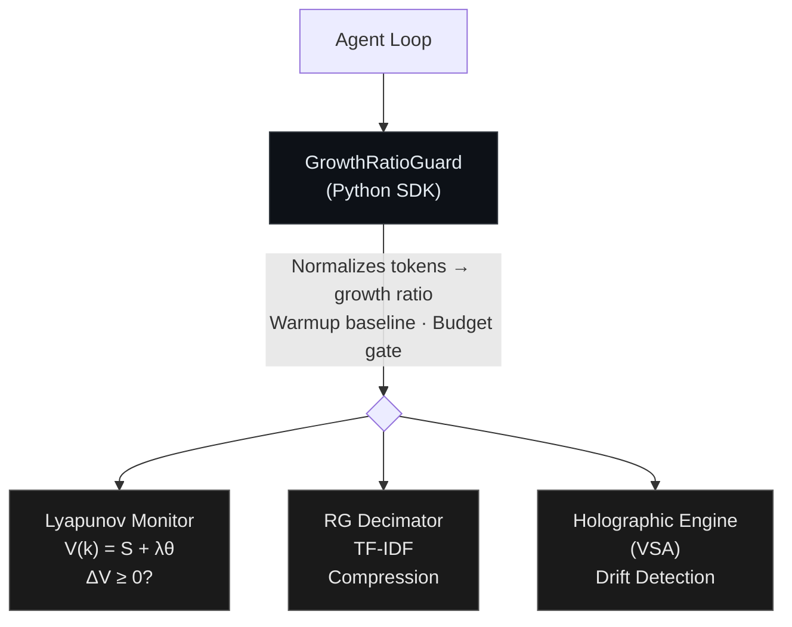

# state-harness 🌀

[](https://pypi.org/project/state-harness/)
[](https://pypi.org/project/state-harness/)
[](https://pypi.org/project/state-harness/)
[](src/)
[](LICENSE.md)

**Runtime safety net for LLM agents.** Does nothing when things work. Saves your budget and tells you *exactly why* when they don't.

```python
from state_harness import GrowthRatioGuard, FailureReport

guard = GrowthRatioGuard(token_budget=50_000)

with guard:
    for turn in agent_loop:
        result = llm.invoke(turn.prompt)
        guard.record_step(tokens_used=result.usage.total_tokens)

# What went wrong? (zero-cost, no LLM calls)
report = FailureReport.from_guard(guard)
print(report)
```

```
⚠️  STABILITY TRIPPED at turn 12

Pattern: Context Accumulation Spiral (confidence: 92%)
  • Last 5 turns all exceeded 1.5× baseline (4/4 were accelerating).
  • Peak growth ratio: 5.2× baseline.
  • Without intervention, projected cost was $0.0396 (actual: $0.0039).

Energy: ▁▁▁▁▁▂▂▃▄▆█
  Baseline: 1050 tokens/turn
  Peak ratio: 5.2× baseline

Cost: $0.0039 (saved ~$0.0357 by tripping early)

Suggested actions:
  🔴 1. Enable RG history compression in your agent loop.
     → Compressing older messages reduces prompt tokens by 40-60%.
  🟡 2. Lower the growth ratio threshold to 1.8×.
     → A lower threshold would have caught it earlier.
  🟢 3. Add a sliding-window context strategy.
     → Send only the last N messages plus a summary of earlier ones.
```

---

## Why this exists

Every team running LLM agents in production has experienced this: an agent gets stuck in a loop, token usage spirals, and you find a $15 charge for a single failed request the next morning. You kill the process — but you have no idea *why* it happened or how to prevent it next time.

A hard budget cap solves the cost problem — but tells you nothing. You know the task was killed. You don't know if it was a context accumulation spiral, a retry storm, or policy drift. You can't fix what you can't diagnose.

State-harness is a **library**, not a platform. `pip install` and go. It uses [Lyapunov stability theory](https://en.wikipedia.org/wiki/Lyapunov_stability) to detect runaway behavior *before* it becomes expensive — and when it trips, it classifies the failure pattern and tells you exactly what went wrong, how to fix it, and how much you saved. All at zero cost — no extra LLM calls, no external APIs.

### What it catches

| Pattern | Signal | Example |
|:---|:---|:---|
| **Context Spiral** | Token growth accelerating beyond baseline | Agent replaying full history each turn |
| **Retry Storm** | Low-variance repeated calls | Tool failing, agent retrying identically |
| **Policy Drift** | VSA similarity score dropping | Agent going off-topic mid-conversation |
| **Early Explosion** | Token spike in first 3 turns | Oversized system prompt or tool response |
| **Budget Exhaustion** | Cumulative spend hits ceiling | Complex task, not necessarily broken |

### What you get — and what you don't

| | |
|:---|:---|
| ✅ **Know WHY your agent failed** | Pattern classification + evidence + fix suggestions — zero LLM cost |
| ✅ **Save compute on failing tasks** | 38.6% fewer search nodes on SWE-bench |
| ✅ **Never interfere with healthy agents** | Zero false positives across 1,886 short/medium-loop runs |
| ✅ **Validated across 2,367 runs** | 3 benchmarks, 5-condition ablation, multi-trial with bootstrap CIs |
| ✅ **Model-agnostic** | Zero false positives confirmed across GPT-4o-mini, Claude Haiku 4.5, and Gemini 2.5 Flash |
| ❌ **Does NOT make your agent smarter** | Resolve rates are statistically identical with or without monitoring |
| ❌ **Does NOT replace a budget cap** | A naive cap achieves comparable success rates — but tells you nothing |

> **The value is diagnostics.** A budget cap tells you "task killed." State-harness tells you "task killed because of a context accumulation spiral — enable history compression to fix it." That difference is why this exists.

### Who should use this

- **Teams running search-tree agents** (MCTS, beam search) — the architecture behind SWE-bench solvers and tools like Devin. Branches, not loops, drive cost. A per-branch iteration cap looks fine in isolation; the tree-level cost explosion happens silently.
- **Platform teams running 1,000+ agent tasks/day** — manual trace inspection doesn't scale. State-harness classifies failure patterns at the edge (zero cost, no LLM calls) and exports them as OpenTelemetry attributes for aggregate analysis.
- **Researchers benchmarking agents** — the nondeterminism floor (~4–5% stdev on Gemini 2.5 Flash) means single-run comparisons with <8% delta are noise. State-harness quantifies this.

### Who should NOT use this

- **Chatbots, RAG pipelines, or single-turn apps** — these don't spiral. You don't need monitoring.
- **Simple ReAct loops with <10 turns** — `max_iterations=10` and a budget cap are sufficient. Every modern framework (LangGraph, CrewAI) supports this natively.

---

## Installation

```bash
pip install state-harness
```

Requires Python ≥ 3.10. Pre-built wheels are available for Linux, macOS, and Windows (x86_64 and ARM64). No Rust toolchain needed.

### From source (for development)

```bash
git clone https://github.com/vishal-dehurdle/state-harness.git
cd state-harness

python -m venv .venv && source .venv/bin/activate

# Install Rust (if not already installed)
curl --proto '=https' --tlsv1.2 -sSf https://sh.rustup.rs | sh

pip install maturin
maturin develop --release

# Run tests
pip install pytest
pytest tests/
```

---

## Quickstart

### Basic: GrowthRatioGuard (recommended)

The `GrowthRatioGuard` normalizes token usage against a baseline, so it only trips on *disproportionate* growth — not the natural growth of multi-turn context windows.

```python
from state_harness import GrowthRatioGuard, StabilityViolation

guard = GrowthRatioGuard(
    token_budget=100_000,     # hard ceiling
    ratio_threshold=2.0,      # trip when turn is 2× the baseline
    window=3,                 # 3 consecutive escalating turns to trip
    budget_gate=8_000,        # don't trip until 8K tokens spent
)

with guard:
    for turn in agent_loop:
        try:
            result = llm.invoke(turn.prompt)
            guard.record_step(
                tokens_used=result.usage.total_tokens,
                errors=0,
            )
        except StabilityViolation as e:
            print(f"Agent killed: {e}")
            break

print(f"Total cost: {guard.total_tokens} tokens")
print(f"Baseline: {guard.baseline} tokens/turn")
print(f"Peak ratio: {guard.current_ratio}×")
```

### Failure Diagnostics

After any execution (tripped or not), get a structured failure report:

```python
from state_harness import FailureReport

report = FailureReport.from_guard(guard, model="gemini-2.5-flash")

# Human-readable terminal output
print(report)

# Structured dict for logging / dashboards
import json
print(json.dumps(report.to_dict(), indent=2))
```

The report classifies the failure pattern, provides evidence, estimates cost impact, and suggests specific fixes — all without any LLM calls.

### Classic: BoundaryGuard

For lower-level control using raw token counts (no normalization):

```python
from state_harness import BoundaryGuard

with BoundaryGuard(token_budget=100_000, lambda_=1.0, window=5) as guard:
    for turn in agent_loop:
        result = llm.invoke(turn.prompt)
        guard.record_step(
            tokens_used=result.usage.total_tokens,
            errors=0,
            tool_name="search",
        )
```

### Decorator: `@boundary_guard`

```python
from state_harness import boundary_guard

@boundary_guard(
    token_budget=50_000,
    token_counter=lambda r: r.usage.total_tokens,
)
def agent_step(prompt: str):
    return llm.invoke(prompt)
```

---

## Framework Integration

### LangGraph (recommended)

```python
from langgraph.prebuilt import create_react_agent
from state_harness.adapters import monitor_graph

agent = create_react_agent(model, tools=[search, calculate])
safe = monitor_graph(agent, token_budget=100_000)

result = safe.invoke({"messages": [("user", "Fix the login bug")]})

# After execution — always available:
print(safe.total_tokens)  # cumulative usage
print(safe.tripped)       # did stability trip?
print(safe.report)        # full FailureReport with pattern + suggestions
```

For streaming:

```python
for chunk in safe.stream({"messages": [("user", "Refactor this module")]}):
    print(chunk)
```

With a trip callback (e.g., for Slack alerts):

```python
safe = monitor_graph(
    agent,
    token_budget=100_000,
    on_trip=lambda report: slack.send(f"Agent tripped: {report.pattern}"),
)
```

<details>
<summary>Advanced: per-tool wrapping with LangGraphMiddleware</summary>

```python
from state_harness import BoundaryGuard
from state_harness.adapters import LangGraphMiddleware

guard = BoundaryGuard(token_budget=150_000)
middleware = LangGraphMiddleware(guard)

@middleware.wrap_tool
def search_database(query: str):
    return db.search(query)

with guard:
    result = agent.invoke({"messages": [...]})
```

</details>

### CrewAI

```python
from crewai import Agent, Task, Crew
from state_harness.adapters import CrewAICallback

callback = CrewAICallback(token_budget=200_000)

crew = Crew(
    agents=[researcher, writer],
    tasks=[research_task, write_task],
    step_callback=callback.step_callback,
    task_callback=callback.task_callback,
)

result = crew.kickoff()
print(callback.report)  # FailureReport
callback.close()
```

### Vanilla Python Hooks

```python
from state_harness import BoundaryGuard
from state_harness.adapters import VanillaHook

guard = BoundaryGuard(token_budget=50_000)
hook = VanillaHook(guard)

with guard:
    for step in agent_loop:
        hook.before_call(tool_name="search")
        result = execute_tool(step)
        hook.after_call(tokens_used=result.tokens)
```

---

## CLI

```bash
# Simulate a token trajectory — see what the guard would do
state-harness simulate 1000 1200 1500 2000 3000 5000 8000 --budget 50000

# Analyze a saved report
state-harness analyze report.json
state-harness analyze report.json --json    # JSON output
state-harness analyze report.json --otel    # OpenTelemetry attributes

# Batch analyze all reports in a directory
state-harness batch --dir ./reports/ --output results.csv
```

## Structured Output

Every `FailureReport` supports multiple output formats:

```python
report = FailureReport.from_guard(guard)

# JSON (for logging, APIs, storage)
report.to_json()            # pretty-printed
report.to_json(indent=None) # compact, single line

# CSV (for batch analysis of 1000s of runs)
with open("results.csv", "w") as f:
    f.write(FailureReport.csv_header() + "\n")
    for r in reports:
        f.write(r.to_csv_row() + "\n")

# OpenTelemetry (for Datadog, Grafana, Honeycomb)
from opentelemetry import trace
span = trace.get_current_span()
span.set_attributes(report.to_otel_attributes())
# Adds: state_harness.pattern, state_harness.confidence, etc.
```

---

## Architecture

State-harness combines three physics-inspired mechanisms, implemented in Rust for microsecond-speed enforcement:



> All three mechanisms are implemented in Rust (via PyO3) for microsecond-speed enforcement.

| Component | Purpose | Speed |
|:---|:---|:---|
| **Lyapunov Monitor** | Tracks energy derivative ΔV(k). Trips when ΔV ≥ 0 for W consecutive steps. | ~1μs/step |
| **RG Decimator** | Compresses conversation history via RG-inspired decimation (TF-IDF scoring). Retains structurally important messages. | ~100µs/compress |
| **Holographic Engine** | VSA-based policy drift detection. Binds domain invariants to high-dimensional vectors. | ~10μs/check |

---

## Benchmarks

Evaluated across three complementary benchmarks with a **5-condition ablation study** (2,367 total runs) isolating each mechanism's contribution. Full methodology and data in the [research paper](https://vishalvermalabs.com/papers/empirical-lyapunov-stability-agent-failure).

### Ablation Conditions

| Condition | Lyapunov | RG Decimation | VSA Dual-Gate | Description |
|:---|:---:|:---:|:---:|:---|
| **A. Baseline** | — | — | — | Unmonitored agent |
| **B. Lyapunov-only** | ✅ | — | — | Energy monitoring, no intervention |
| **C. Lyapunov+RG** | ✅ | ✅ | — | + history compression on violation |
| **D. Full-stack** | ✅ | ✅ | ✅ | + policy drift gating |
| **E. Naive Cap** | — | — | — | Hard budget cap (control) |

### Summary: Non-invasive monitoring with zero-cost diagnostics

| Benchmark | Runs | Stability Trips | Cost Savings (D vs A) | Resolve-Rate Δ | Diagnostics |
|:---|:---:|---:|---:|:---|:---:|
| **MINT** (reasoning + coding) | 1,136 | 0 | ~0% | −0.7pp (noise) | N/A (no trips) |
| **τ³-bench** (customer service) | 750 | 0 | 8.1% | within ±12pp nondeterminism | N/A (no trips) |
| **SWE-bench Verified** (coding) | 333 + 148 | ~38% | 38.6% (nodes) | −3.6pp (within ±4–5% noise) | ✅ Pattern classification |

**What the harness does — and doesn't do:**

- ✅ **Never interferes with healthy agents** — zero stability trips across 1,886 short/medium-loop runs (MINT + τ³)
- ✅ **Saves compute on spiraling tasks** — 38.6% fewer search nodes, 30% faster wall time on SWE-bench
- ✅ **Tells you *why* tasks failed** — zero-cost failure diagnostics (context spiral, retry storm, policy drift) with actionable fixes
- ⚠️ **Does not improve resolve rate** — multi-trial SWE-bench (333 runs) confirms: harness 40.5% ± 2.7% vs naive cap 45.9% ± 5.4% vs baseline 44.1% ± 4.1% — all within noise

> A naive budget cap achieves comparable task success rates. The harness's unique value is **diagnostics** (understanding *why* failures happen) and **compute efficiency** (33% fewer nodes than naive cap).

### SWE-bench Verified (central result)

37 Django instances from SWE-bench Verified. Agent: moatless-tools SearchTree with 50-node budget. Model: Gemini 2.5 Flash.

#### Single-trial ablation (148 runs)

| Condition | Resolved | Rate | Total Nodes | Wall Time | Nodes/Resolve |
|:---|:---:|:---:|---:|---:|---:|
| **A. Baseline** | 15 / 37 | 40.5% | 945 | 80 min | 63.0 |
| **B. Lyapunov** | 16 / 37 | 43.2% | 620 | 69 min | 38.8 |
| **D. Full-stack** | 14 / 37 | 37.8% | **580** | **56 min** | **41.4** |
| **E. Naive Cap** | 21 / 37 | 56.8% | 876 | 77 min | 41.7 |

> **Note:** Single-trial resolve rates have ~±8pp standard error. E's apparent 56.8% is not statistically significant vs A's 40.5%. Multi-trial results below confirm this.

**What the harness provides:**

- **Compute-efficient:** 38.6% fewer search tree nodes than baseline, 33% fewer than naive cap
- **Faster:** 30% wall-time reduction (80 → 56 min)
- **Eliminates burnout:** Baseline had 7 tasks burning the full 50-node budget (all failed). With monitoring: **zero**
- **Diagnostics:** Every tripped task gets a classified failure pattern with actionable fix suggestions — at zero LLM cost
- **Simple integration:** Lyapunov monitoring alone (Condition B) delivers ~90% of total benefit — 5 lines of code

**Ablation — each mechanism contributes independently:**

| Layer Added | Compute (nodes) | Δ vs Baseline | Cumulative Reduction |
|:---|---:|---:|---:|
| A. No monitoring | 945 | — | — |
| B. + Lyapunov | 620 | −325 | **34.4%** |
| D. + RG + VSA | 580 | −40 | **38.6%** |

**Lyapunov monitoring alone delivers ~90% of the total benefit.** RG decimation and VSA add incremental value.

#### Multi-trial validation (333 runs)

To quantify nondeterminism and validate the single-trial findings, we ran **3 independent trials per condition** (A, D, E) across all 37 instances — **333 total runs** (12 runs resulted in stuck Docker containers killed after 28+ min; counted as failures):

| Condition | Trial 1 | Trial 2 | Trial 3 | **Mean ± σ** |
|:---|:---:|:---:|:---:|:---:|
| **A. Baseline** | 18/37 (48.6%) | 16/37 (43.2%) | 15/37 (40.5%) | **44.1% ± 4.1%** |
| **D. Full-stack** | 15/37 (40.5%) | 16/37 (43.2%) | 14/37 (37.8%) | **40.5% ± 2.7%** |
| **E. Naive Cap** | 19/37 (51.4%) | 15/37 (40.5%) | 17/37 (45.9%) | **45.9% ± 5.4%** |

**Key finding:** Cross-condition variance (2.9%) ≤ within-condition nondeterminism (4.1%). The differences between conditions are **entirely within the noise band** of LLM nondeterminism — confirming non-invasiveness with statistical rigor.

> **Note on nondeterminism:** The ~4% within-condition stdev converges with τ³-bench findings (±4.6%), establishing a ~4–5% nondeterminism floor as a fundamental property of Gemini 2.5 Flash on code tasks. Any single-run benchmark comparison is unreliable for deltas < 8%.

**Statistical validation:** Bootstrap confidence intervals (10,000 resamples) and Welch's t-tests confirm no significant pairwise differences: A−D = +3.6pp [−0.9, +8.1], p ≈ 0.17; A−E = −1.8pp [−8.1, +4.5], p ≈ 0.68; D−E = −5.4pp [−10.8, 0.0], p ≈ 0.09. Full analysis in the [research paper §7.3.1](https://vishalvermalabs.com/papers/empirical-lyapunov-stability-agent-failure).

### τ³-bench Airline (non-invasiveness confirmation)

50 tasks × 3 trials × 5 conditions = **750 total runs**. Agent handles airline reservations via tool calls. Model: Gemini 2.5 Flash. Concurrency=1.

| Condition | Trial Pass | Rate | Task Pass (maj) | Rate | Cost | Cost Δ |
|:---|:---:|:---:|:---:|:---:|:---:|:---:|
| **A. Baseline** | 99/150 | 66.0% | 35/50 | 70.0% | $2.47 | — |
| **B. Lyapunov-only** | 83/150 | 55.3% | 28/50 | 56.0% | $2.42 | −2.0% |
| **C. Lyapunov+RG** | 79/150 | 52.7% | 26/50 | 52.0% | $1.69 | −31.8% |
| **D. Full-stack** | 86/150 | 57.3% | 30/50 | 60.0% | $2.28 | **−8.1%** |
| **E. Naive Cap** | 81/150 | 54.0% | 26/50 | 52.0% | $2.33 | −5.7% |

**Key findings:**

- **Zero stability trips across all 750 runs.** The monitor correctly identifies all airline tasks as stable and never intervenes — confirming non-invasiveness on medium-loop customer-service agents.
- **Pass-rate variance is LLM nondeterminism, not harness impact.** The naive cap (E) — which has zero monitoring — shows a −16pp drop from baseline, *worse* than full-stack monitoring (D, −10pp). This confirms the ~10–16pp spread is intrinsic benchmark variance, not monitoring-caused regression.
- **25% of tasks flip pass/fail** within the same condition across 3 trials — the airline domain's intrinsic nondeterminism floor (~±12pp).
- **8.1% cost savings** from full-stack monitoring, with the harness observing passively (zero interventions).

### MINT (non-invasiveness validation)

284 tasks × 4 conditions = **1,136 total runs** across GSM8K (48), MATH (100), HumanEval (45), MBPP (91). Agent uses up to 5 turns per task.

| Condition | GSM8K | MATH | Total | Tokens |
|:---|---:|---:|---:|---:|
| **A. Baseline** | 91.7% | 39.0% | **29.2%** | 1,909,582 |
| **B. Lyapunov** | 91.7% | 41.0% | **29.9%** | 1,904,421 |
| **C. Lyapunov+RG** | 89.6% | 37.0% | **28.2%** | 1,910,926 |
| **D. Full-stack** | 87.5% | 39.0% | **28.5%** | 1,949,708 |

**Zero stability violations across all 1,136 runs.** The monitor correctly identifies short-loop tasks as stable and never intervenes. Token usage is invariant (<2% overhead).

**Failed tasks cost disproportionately more** — validating the economic thesis:

| Task | Success Avg | Failure Avg | Ratio |
|:---|---:|---:|---:|
| GSM8K | 2,613 tok | 8,857 tok | **3.4×** |
| MATH | 5,154 tok | 8,188 tok | **1.6×** |

> **Note:** HumanEval and MBPP show 0% across all conditions due to a MINT framework limitation in code execution evaluation — consistent across all conditions, confirming the harness does not introduce new failure modes.

### Reproducing the benchmarks

<details>
<summary>Full reproduction steps (all three benchmarks)</summary>

```bash
# 1. Clone repos
git clone https://github.com/vishal-dehurdle/state-harness.git
git clone https://github.com/sierra-research/tau-bench.git tau3-bench

# 2. Install state-harness
cd state-harness
python -m venv .venv && source .venv/bin/activate
pip install maturin && maturin develop --release

# 3. Install τ³-bench (with state-harness agent)
cd ../tau3-bench
uv sync
cp ../state-harness/tau3_integration/harness_agent.py src/tau2/agent/
cp ../state-harness/tau3_integration/naive_cap_agent.py src/tau2/agent/

# 4. Configure Vertex AI
export GOOGLE_CLOUD_PROJECT=your-project-id
export VERTEXAI_LOCATION=asia-south1

# 5. Run τ³ 5-phase benchmark
bash benchmarks/tau3/run_5phase_airline.sh

# 6. Run SWE-bench (requires Docker images)
bash benchmarks/swe_bench/run_benchmark.sh
bash benchmarks/swe_bench/run_benchmark_dbe.sh

# 7. Run MINT
bash benchmarks/mint/run_mint_fullstack.sh
```

**Ablation conditions are controlled via environment variables:**

| Variable | Values | Effect |
|:---|:---|:---|
| `HARNESS_RG` | `on` / `off` | Enable/disable RG history compression |
| `HARNESS_VSA` | `on` / `off` | Enable/disable VSA policy drift detection |
| `HARNESS_RATIO_THRESHOLD` | float (e.g., `2.0`) | Override growth ratio threshold |
| `HARNESS_BUDGET_GATE` | int (e.g., `8000`) | Override minimum spend before trip |

</details>

See [benchmarks/](benchmarks/) for full setup, configs, and reproduction instructions for all three benchmarks.

### Future evaluations

- [x] **Multi-trial SWE-bench** — 333 runs (3 trials × 3 conditions × 37 instances) confirming non-invasiveness within ±4% noise band
- [ ] **Terminal-Bench** — Terminal-based agent tasks; command-line tool loops where spirals manifest as repeated failed commands
- [ ] **SWE-bench Pro** — Harder, contamination-resistant variant of SWE-bench
- [x] **Cross-model validation** — GPT-4o-mini, Claude Haiku 4.5, Gemini 2.5 Flash: zero false positives, consistent guard behavior

### Known limitations

1. **37 SWE-bench instances** — A larger sample would improve statistical power (n=3 trials gives limited degrees of freedom for t-tests).
2. **No causal intervention** — The harness currently kills spiraling tasks. Redirect/repair is on the roadmap.
3. **Physics-inspired, not physics-equivalent** — Terms like "Renormalization Group" and "Lyapunov stability" are used as structural inspirations. The mathematical mapping is analogical, not isomorphic.

---

## Configuration Guide

| Parameter | Default | Description |
|:---|:---|:---|
| `token_budget` | 100,000 | Hard ceiling on cumulative tokens |
| `ratio_threshold` | 2.0 | Growth ratio above which a turn counts as "escalating" (domain-tuned: airline=2.0, retail=2.5, telecom=2.0) |
| `window` | 3 | Consecutive escalating turns before circuit breaker trips |
| `warmup_turns` | 3 | Turns used to establish baseline (no monitoring during warmup) |
| `budget_gate` | 8,000 | Minimum cumulative tokens before the monitor can trip (retail: 12,000) |
| `lambda_` | 1.0 | Error weighting in the Lyapunov energy function |

**Environment variable overrides** (highest precedence, for threshold sweeps):

| Env Var | Description |
|:---|:---|
| `HARNESS_RATIO_THRESHOLD` | Override ratio_threshold (e.g., `2.5`) |
| `HARNESS_BUDGET_GATE` | Override budget_gate (e.g., `12000`) |

**Tuning tips:**
- **More aggressive** (catch spirals earlier): `ratio_threshold=1.8, window=2`
- **More conservative** (fewer false positives): `ratio_threshold=2.5, window=3`
- **High-value tasks**: Increase `budget_gate` to 20K+ to let expensive tasks run longer
- **Complex domains** (retail, multi-tool): Start with `ratio_threshold=2.5`

---

## Theoretical Foundations

State-harness applies control theory to LLM agent execution:

- **Lyapunov stability**: The energy function V(k) = S(k) + λθ(k) models token consumption as a dynamical system. When ΔV ≥ 0 for W consecutive steps, the system is provably unstable.
- **Renormalization Group (RG) theory**: Message compression is modeled as coarse-graining — eliminating high-frequency noise while preserving scale-invariant task objectives.
- **Vector Symbolic Architecture (VSA)**: Domain policies are bound to high-dimensional bipolar vectors (10,000-d, i8 space), enabling constant-time semantic drift detection outside the LLM context window.

---

## Research

This library implements the framework described in:

> **Empirical Lyapunov Stability: Growth-Ratio Energy Functions as Leading Indicators of Agent Task Failure**
> Vishal Verma, 2026
> [Read the full paper →](https://vishalvermalabs.com/papers/empirical-lyapunov-stability-agent-failure)

Key findings from the paper (updated with multi-trial validation):
- **Non-invasiveness confirmed across 333 SWE-bench runs** — resolve rate delta (−3.6pp) falls within the ±4.1% nondeterminism band
- **Zero stability violations** across 1,886 short/medium-loop runs (MINT + τ³) — the monitor never interferes with healthy agents
- **Zero-cost failure diagnostics** — every tripped task is classified (context spiral, retry storm, policy drift) with actionable fix suggestions, requiring no additional LLM calls
- **Lyapunov monitoring alone delivers ~90% of the total benefit** — the simplest integration (5 lines of `GrowthRatioGuard` code) captures the majority of the value
- On long-loop agents (SWE-bench), full-stack monitoring reduces compute by 38.6% and wall time by 30%
- Failed tasks cost **1.6–3.4× more** than successful ones — economic justification for early termination
- Eliminates all max-budget burnout events (7 → 0 tasks hitting the 50-node ceiling on SWE-bench)
- **~4–5% nondeterminism floor** established across both τ³-bench and SWE-bench — any single-run comparison is unreliable for deltas < 8%

Based on the theoretical framework from:
> **The Fluid Dynamics of Multi-Agent AI: Resolving d'Alembert's Paradox of Generative Workflows**
> Vishal Verma, 2026
> [Read →](https://vishalvermalabs.com/papers/fluid-dynamics-multi-agent-ai)

---

## Contributing

Contributions are welcome. See [CONTRIBUTING.md](CONTRIBUTING.md) for dev environment setup, code style, and PR guidelines.

---

## Roadmap

- [ ] **Adaptive threshold** — Auto-tune τ based on task complexity signal from early turns
- [ ] **Causal intervention** — Instead of killing spiraling tasks, redirect them (prompt injection, tool restriction)
- [ ] **Streaming support** — Token-level monitoring for streaming LLM responses
- [ ] **Multi-model validation** — Verify threshold stability across GPT-4o, Claude Sonnet 4, Llama 4
- [ ] **Dashboard / observability** — Optional lightweight UI for monitoring energy trajectories in real-time

---

## Security

For security vulnerabilities, see [SECURITY.md](SECURITY.md). Please do **not** open public issues for security reports.

---

## License

Split-core licensing:

| Component | License | Notes |
|:---|:---|:---|
| **Rust Core** (`src/`) | BSL 1.1 | Free for non-commercial + ARR < $1M. Converts to Apache 2.0 on May 26, 2030. |
| **Python SDK** (`python/`) | Apache 2.0 | Fully permissive. |

See [LICENSE.md](LICENSE.md) for full details.